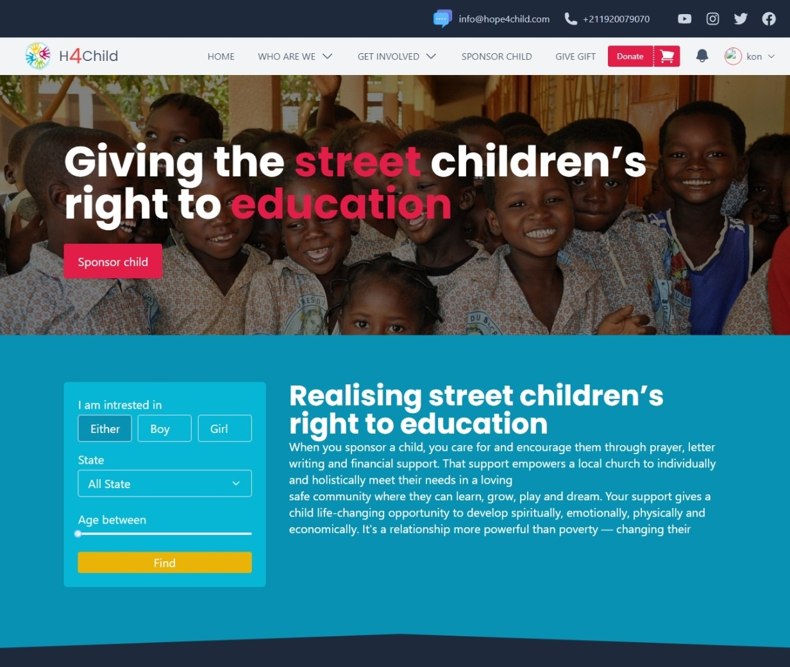

# Hope for Child


Simple overview of use/purpose.

## requirements
- node version 17 and above
- git 2.29.2.windows.3

## Description

## Getting Started

### Dependencies

* [Reactjs]()
* [tailwindcss]()
* [tanstack](https://tanstack.com)
* [react-share]()
* [firebase]()
* [glidejs]()
* [framer-motion]()
* [formik]()
* [rc-slider]()
* [axios]()


## clone the project

```
git clone https://github.com/Konson22/hope4child.git
```
### Installing

```
npm install or yarn install
```

### Executing program

```
npm start or yarn start
```

## Help

Any advise for common problems or issues.
```
command to run if program contains helper info
```

## Authors

Contributors names and contact info

Konson Ak  
[@konsonak](https://twitter.com/dompizzie)


## License

This project is licensed under the [NAME HERE] License - see the LICENSE.md file for details

